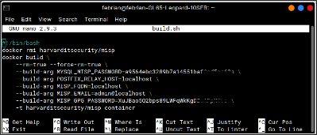

Installation (Tahap Instalasi)
==============================

Pada Tahap ini merupakan tahapan instalasi terhadap *tools* dan *package* yang dibutuhkan dalam membangun sandbox `MISP <https://www.misp-project.org/>`_.

Instalasi Docker
^^^^^^^^^^^^^^^^ 

1.  Langkah awal Adalah Cek versi ubuntu yang digunakan, Docker membutuhkan versi 64-bit serta mendukung arsitektur seperti x86_64 (amd64) dengan perintah :

.. code-block:: RST

  $ uname -a

2.  Kemudian lakukan uninstall versi lama docker seperti docker, docker.io, atau docker-engine yang mungkin sebelumnya pernah diinstall, Perintah yang dijalankan :

.. code-block:: RST

  $ sudo apt-get remove docker docker-engine docker.io containerd runc

3.  Selanjutnya adalah instalasi Docker, terdapat beberapa cara yang bisa digunakan. Disini digunakan metode instalasi Docker dari repositori yang memudahkan dalam proses instalasi dan upgrade. 

.. code-block:: RST

  $ sudo apt-get update
  $ sudo apt-get install \
   >   apt-transport-https \
   >   ca-certificates \
   >   curl \
   >   gnupg-agent \
   >   software-properties-common

4.  Selanjutnya tambahkan Docker’s official GPG key.

.. code-block:: RST

  $ curl -fsSL https://download.docker.com/linux/ubuntu/gpg | sudo apt-key add -

5.  Lakukan verivikasi bahwa kita sudah mempunyai kunci dengan fingerprint 9DC8 5822 9FC7 DD38 854A  E2D8 8D81 803C 0EBF CD88. Untuk melakukan verifikasi dapat dengan menjari 8 karakter terkhir dari fingerprint.

.. code-block:: RST

  $ sudo apt-key fingerprint 0EBFCD88

6.  Selanjutnya tambahkan stable repository untuk x86_64/amd64.

.. code-block:: RST

  $ sudo add-apt-repository \
  > "deb [arch=amd64] https://download.docker.com/linux/ubuntu \
  > $(lsb_release -cs) \
  > stable"

7.  Dilakukan update apt kembali dan diinstall versi terbaru dari Docker Engine serta container.

.. code-block:: RST

  $ sudo apt-get update
  $ sudo apt-get install docker-ce docker-ce-cli containerd.io docker-compose

Instalasi MISP Docker
^^^^^^^^^^^^^^^^^^^^^ 

1. Download source MISP Docker dari `github <https://github.com/MISP/misp-docker/>`_ 

.. code-block:: RST

  $ git clone https://github.com/harvard-itsecurity/docker-misp.git

2.  Pindah ke direktori docker-misp dan modifikasi file build.sh untuk mengganti password (MySQL dan GPG) serta mengganti MISP_FQDN sesuai domain yang dimiliki.

.. code-block:: RST

  $ cd docker-misp
  $ nano build.sh

contoh konfigurasi file build.sh :

3.  Menjalankan instalasi dari dalam direktori docker-misp

.. code-block:: RST

  $ ./build.sh

Instalasi PyMISP
^^^^^^^^^^^^^^^^

1.  Download source PyMISP dari `link github <https://github.com/MISP/PyMISP.git/>`_

.. code-block:: RST

  $ git clone https://github.com/MISP/PyMISP.git

2.  Periksa bahwa layanan cron telah berjalan dengan baik

.. code-block:: RST

   $ cd PyMISP
   $ python3 setup.py

Instalasi cronjob
^^^^^^^^^^^^^^^^^

1.  Install cronjob dari repository

.. code-block:: RST

  $ sudo apt-get install cron

2.  Periksa bahwa layanan cron telah berjalan dengan baik

.. code-block:: RST

  $ sudo systemctl status cron

