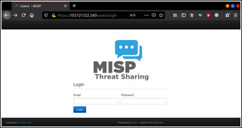
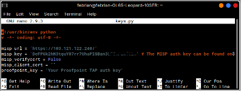
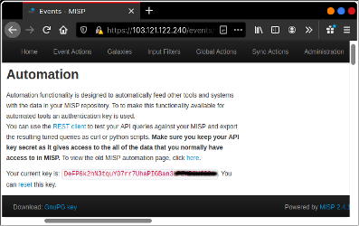
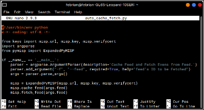
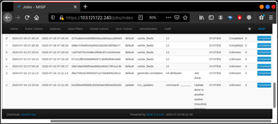
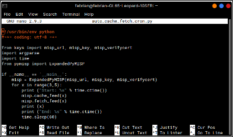
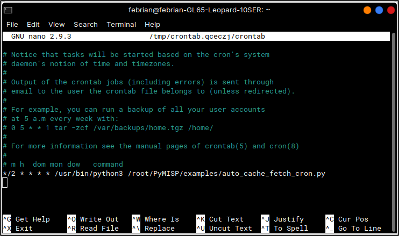
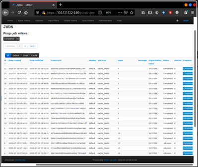

Usage (Penggunaan)
==================

Penggunaan MISP Docker
^^^^^^^^^^^^^^^^^^^^^^

1.  Melakukan inisiasi database

.. code-block:: RST

  $ docker run -it --rm \
  >	-v /docker/misp-db:/var/lib/mysql \
  >	harvarditsecurity/misp /init-db

2.  Menjalankan container

.. code-block:: RST

  $ docker run -it -d \
  >	-p 443:443 \
  >	-p 80:80 \
  >	-p 3306:3306 \
  >	-p 6666:6666 \
  >	-v $docker-root/misp-db:/var/lib/mysql \
  >	harvarditsecurity/misp

3.  Mengakses web URL di browser

.. code-block:: RST

  https://localhost (atau sesuai konfigurasi pada MISP_FQDN)

  Username : admin@admin.test
  Password : admin

4.  Login ke MISP web dengan username dan password default. Selanjutnya lakukan perubahan pada password default.

Penggunaan PyMISP
^^^^^^^^^^^^^^^^^

**Penggunaan Add Event Otomatis (Auto Cache dan Fetch Events) PyMISP Per 1 Feed**.

1.  Masuk ke direktori PyMISP/examples

.. code-block:: RST

  $ cd PyMISP/examples

2.  Salin file keys.py.sample menjadi file keys.py

.. code-block:: RST

  $ cp keys.py.sample keys.py

3.  Modifikasi konfigurasi keys.py sesuai API key dari MISP yang terdapat pada Automation section di MISP web

.. code-block:: RST

  $ nano keys.py

Contoh konfigurasi keys.py :

4.  Modifikasi script Python untuk cache feed dan fetch events pada file auto_cache_fetch.py seperti berikut.

.. code-block:: RST

  #!/usr/bin/env python
  #-*- coding: utf-8 -*-

  from keys import misp_url, misp_key, misp_verifycert
  import argparse
  from pymisp import ExpandedPyMISP

  if __name__ == '__main__':
     parser = argparse.ArgumentParser(description='Cache Feed and Fetch Evens from         Feed.')
    parser.add_argument("-f", "--feed", required=True, help="feed's ID to be Fetched")
    args = parser.parse_args()

    misp = ExpandedPyMISP(misp_url, misp_key, misp_verifycert)
    misp.cache_feed(args.feed)
    misp.fetch_feed(args.feed)

5.  Jalankan file python auto_cache_fetch.py dan beri nomor ID

.. code-block:: RST

  python auto_cache_fetch.py -f 12

6.  Pada website MISP akan muncul seperti berikut

**Penggunaan Add Event Otomatis (Auto Cache dan Fetch Events) PyMISP Lebih dari 1 Feed Menggunakan Cronjob**

1.  Masuk ke direktori PyMISP/examples

.. code-block:: RST

  $ cd PyMISP/examples

2.  Salin file auto_cache_fetch.py menjadi auto_cache_fetch_cron.py

.. code-block:: RST

  $ cp auto_cache_fetch.py auto_cache_fetch_cron.py

3.  Modifikasi script Python untuk cache feed dan fetch events lebih dari 1 feed

.. code-block:: RST

  #!/usr/bin/env python
  #-*- coding: utf-8 -*-

  from keys import misp_url, misp_key, misp_verifycert
  import argparse
  import time
  from pymisp import ExpandedPyMISP

  if __name__ == '__main__':
    misp = ExpandedPyMISP(misp_url, misp_key, misp_verifycert)
    for x in range(3,5):
        print ("Start: %s" % time.ctime())
        misp.cache_feed(x)
        misp.fetch_feed(x)
        print (x)
        print ("End: %s" % time.ctime())
        time.sleep(60)

4.  Modifikasi file crontab dengan menambahkan konfigurasi berikut untuk membuat crontabnya.

.. code-block:: RST

  */2 * * * * /usr/bin/python3 /root/PyMISP/examples/auto_cache_fetch_cron.py

Script tersebut memiliki pengertian bahwa setiap 2 menit sekali, feed dengan ID 3 dan ID 4 akan secara otomatis berkala melakukan auto cache dan fetch events.

5.  Pada website MISP akan muncul tampilan seperti berikut.

